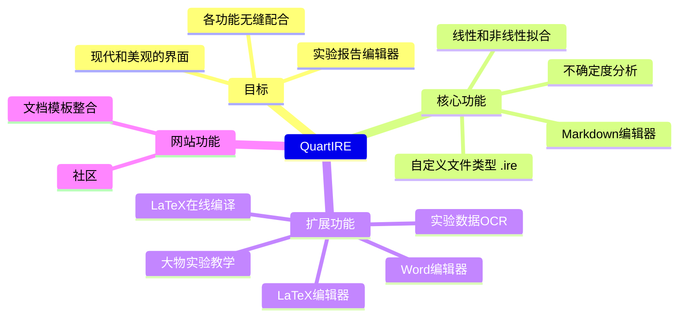
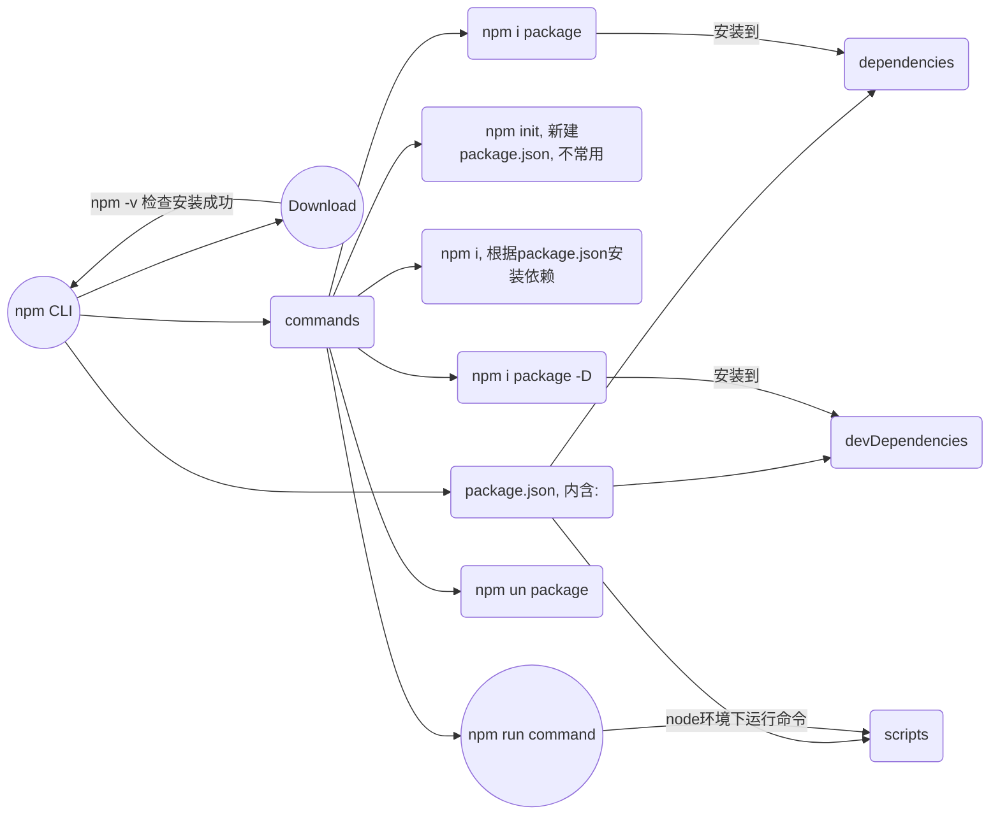
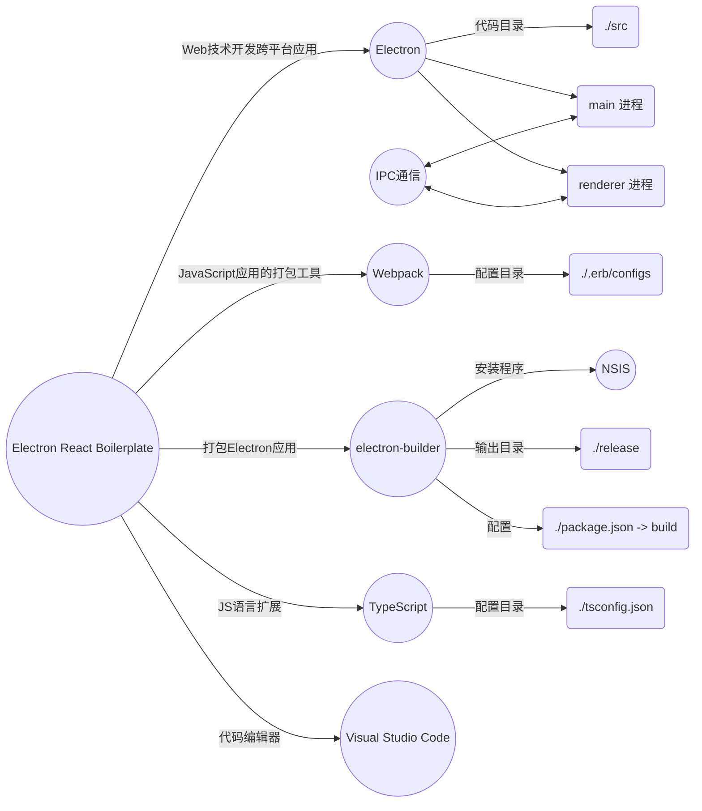
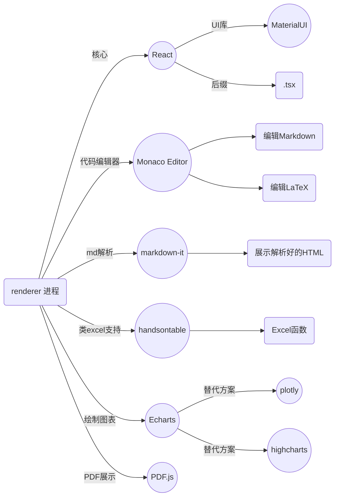

```mermaid
mindmap
QuartIRE
  目标
    实验报告编辑器
    各功能无缝配合
    现代和美观的界面
  核心功能
    Markdown编辑器
    不确定度分析
    线性和非线性拟合
    自定义文件类型 .ire
  扩展功能
    LaTeX编辑器
    LaTeX在线编译
    Word编辑器
    实验数据OCR
    大物实验教学
  网站功能
    文档模板整合
    社区
```

```mermaid
graph LR
  A((npm CLI)) --> B((Download)) -- npm -v 检查安装成功 --> A
  A --> C(package.json, 内含:) --> D1(dependencies)
  C --> D2(devDependencies)
  C --> D3(scripts)
  A --> E(commands)
  E --> F6(npm init, 新建package.json, 不常用)
  E --> F5(npm i, 根据package.json安装依赖)
  E --> F1(npm i package) --安装到--> D1
  E --> F2(npm i package -D) --安装到--> D2
  E --> F3(npm un package)
  E --> F4((npm run command)) --node环境下运行命令--> D3


click A "https://docs.npmjs.com/cli/v9"
click B "https://nodejs.org/en/download"
click F4 "https://docs.npmjs.com/cli/v9/using-npm/scripts#npm-run-user-defined"
```

```mermaid
graph LR
  B --代码目录--> B3(./src)
  A((Electron React Boilerplate)) --Web技术开发跨平台应用--> B((Electron)) --> B1(main 进程)
  B --> B2(renderer 进程)
  C((IPC通信)) <--> B1
  C <--> B2
  A --JavaScript应用的打包工具--> D((Webpack)) --配置目录--> D1(./.erb/configs)
  A --打包Electron应用--> E((electron-builder)) --安装程序--> E1((NSIS))
  E --输出目录--> E2(./release)
  E --配置--> E3(./package.json -> build)
  A --JS语言扩展-->F((TypeScript)) --配置目录--> F1(./tsconfig.json)
  A --代码编辑器-->G((Visual Studio Code))

click A "https://electron-react-boilerplate.js.org/"
click B "https://www.electronjs.org/zh/docs/latest/tutorial/process-model"
click C "https://www.electronjs.org/zh/docs/latest/tutorial/ipc"
click D "https://www.webpackjs.com/"
click E "https://www.electron.build/"
click E1 "https://www.electron.build/configuration/nsis"
click F "https://www.runoob.com/typescript/ts-tutorial.html"
click G "https://code.visualstudio.com/"
```

```mermaid
graph LR
A(renderer 进程)  --核心--> B((React)) --UI库--> B1((MaterialUI))
B --后缀--> B2(.tsx)
A --代码编辑器--> C((Monaco Editor)) --> C1(编辑Markdown)
C --> C2(编辑LaTeX)
A --md解析--> D((markdown-it)) --> D1(展示解析好的HTML)
A --类excel支持--> E((handsontable)) --> E1(Excel函数)
A --绘制图表--> F((Echarts)) --替代方案--> F1((plotly))
F --替代方案--> F2((highcharts))
A --PDF展示--> G((PDF.js))

click B "https://react.docschina.org/"
click B1 "https://mui.com/"
click C "https://microsoft.github.io/monaco-editor/"
click D "https://github.com/markdown-it/markdown-it"
click E "https://handsontable.com/docs/react-data-grid/"
click F "https://echarts.apache.org/zh/index.html"
click F1 "https://plotly.com/javascript/"
click F2 "https://www.hcharts.cn/demo/highcharts"
click G "https://gitcode.gitcode.host/docs-cn/pdf.js-docs-cn/index.html"
```
